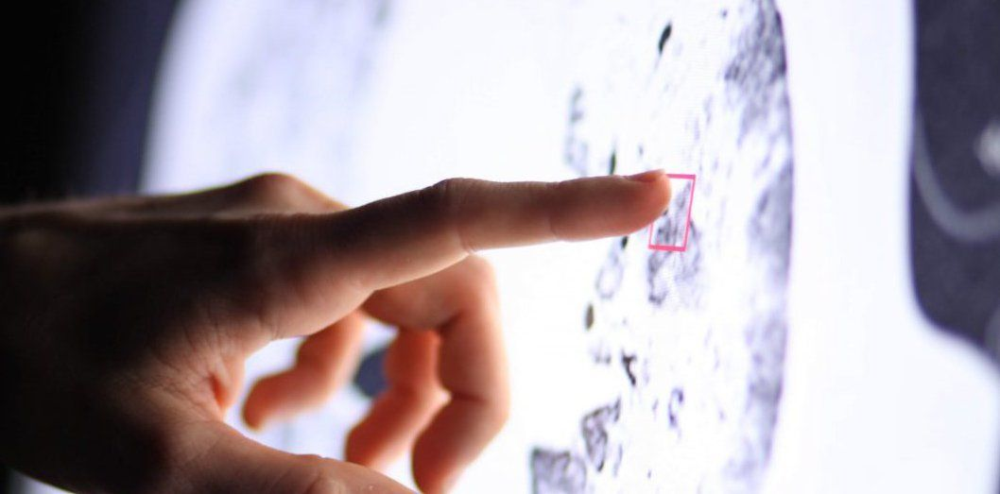

# 15th Deep Learning Meetup in Vienna: Computer Vision

* Date: 2018-01-09
* Venue: weXelerate
* Meetup Page: https://www.meetup.com/de-DE/Vienna-Deep-Learning-Meetup/events/245937916/

## Details

Hi Deep Learners,

A new year and a fresh new location: weXelerate - Europe's hottest startup space. What can be better? A number of really exciting talks about fresh new topics, centered around Deep Learning in Computer Vision!

This is our agenda for our meetup on January 9th, 2018:

* Welcome & Introduction
* Computer Vision - then and now (Alexander Schindler, AIT & TU Wien) - CANCELLED
* Transfer Learning for fun and profit (Alexander Hirner, MoonVision)
* Deep Learning on 3D Medical Image Data at Contextflow (Contextflow)
* Latest news and trends from NIPS, the world's largest AI conference (Rene Donner, Contextflow; Jan Schlüter, OFAI)

Here are the details about the talks:

(1) Computer Vision - then and now (Alexander Schindler, AIT & TU Wien)
"From counting pixels to distinguishing Chihuahuas from Muffins"

This presentation provides a brief introduction to image processing to elaborate the advantage of Deep Learning based over traditional approaches.

(2) Transfer learning for fun and profit (Alexander Hirner, MoonVision)

Moonvision provides customized object tracking solutions. With very little setup time, we needed to track lots of dishes at the Oktoberfest 2017. This talk explains how we used transfer learning to mine those dishes without prior data from raw video. Lastly, we’ll cover the human success factors of such a project.

(3) Deep Learning on 3D Medical Image Data at Contextflow

Radiology image search powered by deep learning. The Contextflow image search engine uses end-to-end deep learning to put the knowledge encoded in millions of medical images and reports at Radiologist's fingertips. Based on a marked region of interest we identify visually similar cases and their findings, enabling Radiologists to within a second compare a new case to thousands of similar cases for faster and more accurate diagnosis. In this talk we will share some insights and learning from applying deep learning to large medical image data.

(4) News and trends from NIPS (Rene Donner, Contextflow)

NIPS is the largest AI-related conference, where latest scientific results are presented from the big names in Deep Learning. Rene Donner from Contextflow attended the conference in December and will report on important topics that are very relevant for the Deep Learning community, e.g.:

* Self-normalizing exponential linear units: replacing Batch Normalization?
* Population based training: extremely efficient hyperparameter optimization
* Overview over current trends: Meta-learning, improved GANs, ...

This section will be complemented by one of our hosts, Jan Schlüter, on other hot topics in Deep Learning.

We are very grateful to weXelerate for providing their all new startup space as a venue for this evening, and also offering drinks and snacks! We are excited and very much looking forward to kick-off the 2018 Deep Learning meetup series at this special venue!

See you soon at the Meetup!
Tom, Jan and Alex