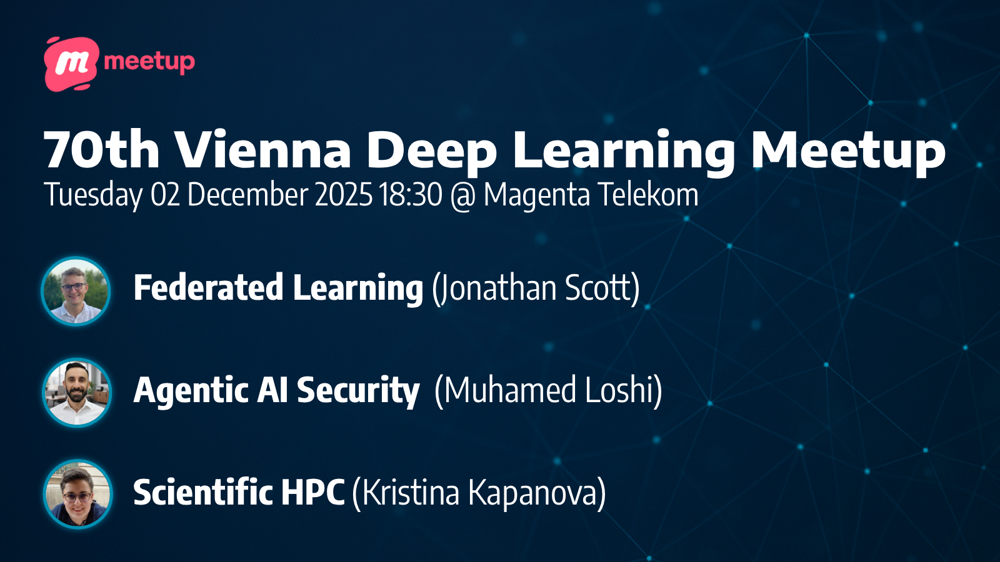

# 70th Deep Learning Meetup: Federated Learning,Agentic AI Security,Scientific HPC

https://www.meetup.com/vienna-deep-learning-meetup/events/311935189/

Hi Deep Learners,

Our next Deep Learning Meetup is taking place on December 2 at Magenta Telekom and this time we are touching multiple topics: Federated Learning, Agentic AI Security, and Scientific HPC.
(This will be our 70th meetup and the last meetup this year!)

## Agenda:

* 18:30 Introduction & Welcome by the meetup organizers & hosts
* 18:45 Talk 1: An Introduction to Federated Learning and Approaches to Personalization by Jonathan Scott (Institute of Science and Technology Austria)
* 19:20 Talk 2: The Security of MCP in Agentic AI Systems: Risks, Attacks, and Defenses by Muhamed Loshi (Raiffeisen Bank International)
* 20:00 Announcements
* Networking Break
* 20:30 Talk 3: Managing High Performance Scientific Computing Infrastructure by Kristina Kapanova (Institute of Science and Technology Austria)
* 21:00 Short Talk: Hydrating Supercomputers: Making HPC accessible by combining industry grade orchestration with the power of supercomputers by Georg Heiler (Magenta Telekom)
* 21:10 Networking
* 22:00 Wrap up & End

## Talk Details:

### Talk 1: An Introduction to Federated Learning and Approaches to Personalization

Federated learning addresses the problem of training machine-learning models when data is private and distributed across many devices. This talk introduces the core methods and techniques of federated learning, and highlights one of its central challenges: statistical heterogeneity, the fact that data across devices can differ significantly. We present approaches that tackle this challenge using hypernetworks to enable personalized federated learning.

**About the Speaker:**
Jonathan Scott is a PhD Student at the Institute of Science and Technology Austria (ISTA). Over the course of his PhD he has worked on a range of topics in federated learning and privacy and his work has been published at international conferences.

### Talk 2: The Security of MCP in Agentic AI Systems: Risks, Attacks, and Defenses

This talk explores the intersection of Model Context Protocol (MCP) and agentic AI systems, focusing on its role, challenges, and security implications. We will clarify what MCP is, how it supports agent-to-agent (A2A) interactions, and the problems it aims to solve in the AI ecosystem. The session will also examine attack techniques against MCP servers, highlighting vulnerabilities and common exploitation methods. Finally, we will discuss practical defense strategies to mitigate security risks, offering a framework for building resilient and secure AI agent infrastructures.

**About the Speaker:**
Muhamed Loshi is a cybersecurity expert with over a decade of experience and responsible for AI security at Raiffeisen Bank International AG. He also contributes as a co-author to the OWASP AI Exchange.

### Talk 3: Managing High Performance Scientific Computing Infrastructure

Managing high-performance scientific computing infrastructure is no longer just a technical challenge—it is a question of service design, sustainability, and strategy. This talk will explore how modern HPC facilities can evolve from ad-hoc clusters into reliable, energy-aware research platforms. I will discuss practical approaches to lifecycle management for compute and storage, building a robust management layer, and using telemetry to guide capacity planning and incident response. A particular focus will be on balancing AI/GPU and simulation workloads while optimizing for power, cooling, and cost to reduce environmental impact.

**About the Speaker:**
Kristina Kapanova is a Manager of Scientific Computing at the Institute of Science and Technology Austria (ISTA). She holds a PhD in Computer Science and has several years of experience in managing supercomputing centers. Previously, she served as Head of AI HPC Compute and Software Engineering at Tübingen in Germany.

### Short Talk: Hydrating Supercomputers: Making HPC accessible by combining industry grade orchestration with the power of supercomputers

This lightning talk shows the benfits of combining the data orchestrator Dagster with the power of a supercomputer:
- easy shift of workload between environments
- end-to-end pipeline running on different infrastructures
- clear observability of structured metrics.

**About the Speaker:**
Georg Heiler is a Research software engineer at Complexity Science Hub and a Senior Data Expert at Magenta.

We'd like to thank Magenta Telekom for providing the venue, drinks & snacks.

We are very much looking forward to seeing you at our final 2025 meetup!
Your VDLM organizers