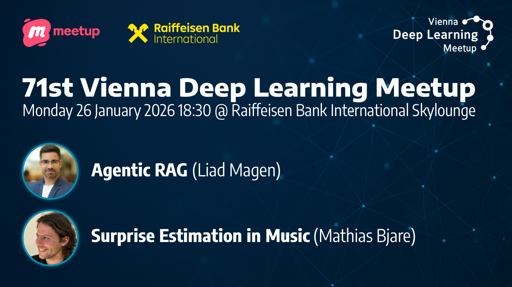

# 71st Deep Learning Meetup: Agentic RAG / Music Surprise Estimation

https://www.meetup.com/vienna-deep-learning-meetup/events/312835585/

Hi Deep Learners,

Our first Deep Learning Meetup in 2026 is taking place on January 26 at Sky lounge of Raiffeisenbank International in Wien Mitte. Our topics this time are: Agentic RAG and Surprise Estimation in Music.

## Agenda:

* 18:30 Introduction by the meetup organizers
* Welcome by the host: Raiffeisenbank International
* 18:45 Talk 1: Agentic RAG: Advances in Autonomous Information Retrieval, Quantized Indexing, and Scalable System Design by Liad Magen (Raiffeisen Bank International)
* 19:30 Announcements
* Networking Break
* 20:00 Talk 2: Surprise Estimation in Music by Mathias Bjare (Johannes Kepler University)
* 20:45 Networking
* 22:00 Wrap up & End

## Talk Details:

### Talk 1: Agentic RAG: Advances in Autonomous Information Retrieval, Quantized Indexing, and Scalable System Design

Agentic RAG systems enable AI to plan how to find and utilize information autonomously, moving beyond simple lookup-and-answer patterns. Traditional RAG follows a fixed approach: retrieve documents, then generate an answer. Agentic RAG, on the other hand, utilizes autonomous agents that can reason through problems in multiple steps, reformulate queries intelligently, and adapt their retrieval strategy based on what they discover. This talk examines the architecture and capabilities of agentic RAG, focusing on how retrieval strategies have evolved to support multi-hop reasoning (following chains of related information), tool integration, and agent-driven workflows. Special attention will be paid to recent advances in quantized indexing and vector search, including Matryoshka embeddings. This technique stores information at multiple levels of detail, enabling scalable retrieval with tunable trade-offs between accuracy and storage.

**About the Speaker:**
Liad Magen is a senior data scientist at Raiffeisen Bank International (RBI) and serves as the product owner of the Data Science Academy, an internal school within the RBI to upskill employees in machine learning and data science. In addition, he is teaching selected courses on NLP, computer vision and Information Retrieval as part of Master's degrees in Hochschule Campus Wien (HCW) and the university of applied sciences - IMC Krems.

### Talk 2: Surprise Estimation in Music

The presentation will focus on Bjare's work on latent autoregressive diffusion models for computationally estimating experienced "expectedness" and "surprise" (surprisal) in music listening, presented at Neurips 2025 - AI for Music Workshop. We revisit an established connection between music appreciation during listening and the extent to which humans or autoregressive models can predict musical continuations. We visit Music2Latent, an open-source, computationally efficient audio codec used as the audio representation on which surprisal is modeled. We review GPT-style autoregressive diffusion models and show how they are suitable for surprisal estimation. We discuss the prediction of EEG responses to music listening based on our surprise estimates.

**About the Speaker:**
Mathias Rose Bjare is a fourth year PhD student at the Institute of Computational Perception, Johannes Kepler University Linz, Austria. He builds computational models for the estimation of musical expectancy and surprisal in audio and general symbolic music using modern artificial neural networks. His surprisal estimates enable research into how features of general recorded music correlate with neural responses to music listening

We'd like to thank Raiffeisen International for providing the venue, drinks & snacks.

Please note that the venue has a capacity limit of 120 people and people will be admitted on a first come, first served basis.

We are very much looking forward to seeing you at our first meetup in 2026!
Your VDLM organizers