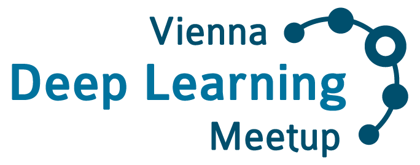

# Vienna Deep Learning Meetup
## Slides & Resources

## Overview

Deep Learning is currently a big & growing trend in data analysis and prediction - and the main fuel of a new era of AI. Google, Facebook and others have shown tremendous success in pushing image, object & speech recognition to the next level.

But Deep Learning can also be used for so many other things! The list of application domains is literally endless.

Although rooted in Neural Network research already in the 1950's, the current trend in Deep Learning is unstoppable, and new approaches and improvements are presented almost every month.

We would like to meet and discuss the latest trends in Deep Learning, Neural Networks and Machine Learning, and reflect the latest developments, both in industry and in research.

The **Vienna Deep Learning Meetup** is positioned at the cross-over of research to industry - having both a focus on novel methods that are published in such a fast pace, and interesting new applications in the startup and industry world. We usually have 2 speakers from either academia, startups or industry, complemented by a "latest news and hot topics" section. Occasionally we do tutorials about software frameworks and how to use Deep Learning in practice. Each evening ends with networking & discussions over drinks and snacks.

Note that this meetup has an intermediate to advanced level (we have done introductions to Deep Learning and neural networks only in the beginning, but try to repeat the most important concepts regularly).

If you want to attend this meetup, sign up at our [Meetup page](https://www.meetup.com/Vienna-Deep-Learning-Meetup/).

## Resources

* Meetup page: https://www.meetup.com/Vienna-Deep-Learning-Meetup/
* Wiki: https://github.com/vdlm/meetups/wiki
* Youtube Channel: https://www.youtube.com/channel/UCAVBJhzHK-jleJbyYTDp8cA

## Your Hosts

|   |   |
|:-:|:-:|
|         | **Thomas Lidy** has been a researcher on music & AI at [TU Wien](http://www.ifs.tuwien.ac.at/) from 2004 to 2017. After positions as Head of ML and Senior Director of AI and Data Science at [Musimap](https://www.musimap.com) and Utopia Music, respectively, he is currently the Head of Data Science and AI at [iGroove Music](https://www.igroovemusic.com/). |
|                | **Jan Schlüter** has been pursuing research on deep learning for audio processing since 2010, currently as a university assistant at the [Johannes Kepler University Linz](https://www.jku.at/en/institute-of-computational-perception/). |
| | **Alexander Schindler** researches audio-visual aspects of music information. He is machine learning specialist at the Digital Insight Lab of the AIT Austrian Institute of Technology and lecturer at the Technical University of Vienna. [[LinkedIn](https://www.linkedin.com/in/schindleralexander)]
|                                      | **René Donner** is a Co-Founder and former CTO at contextflow. Currently he is building the medical image annotation platform [mva.ai](https://mva.ai) |
|                                      | **Pavol Harar** is a Computational Scientist for BioAI & Cryo-Electron Tomography at [ISTA](https://ista.ac.at) and a Co-founder of [ACAI.AI](https://acai.ai) [[Personal web](https://pavol.harar.eu) / [LinkedIn](https://www.linkedin.com/in/pavol-harar/)] |

## Meetups

| Date | #  | Speaker | Topic | Slides | Details                         |
| ---- | -- | ------- | ----- | ------ |---------------------------------|
|      |    |         |       |        |                                 |
| 2025-10-23 |  69 | VDLM  | Intro / Annoucements | [pdf](<./Meetups/Meetup_69/2025-10-23_69th_VDLM.pdf>) | [details](./Meetups/Meetup_69/) |
| 2025-10-23 |  69 | Rahim Entezari  | Real-time Video Generation with Diffusion Models | [pdf](<./Meetups/Meetup_69/RahimEntezari_FastVideoGeneration.pdf>) | [details](./Meetups/Meetup_69/) |
| 2025-10-23 |  69 | Florian Kowarsch  | Mixture of Experts | [pdf](<./Meetups/Meetup_69/Mixture_of_Experts.pdf>) | [details](./Meetups/Meetup_69/) |
| 2025-09-22 |  68 | VDLM  | Intro / Annoucements | [pdf](<./Meetups/Meetup_68/2025-09-22 68th VDLM.pdf>) | [details](./Meetups/Meetup_68/) |
| 2025-09-22 |  68 | Marc Kroll  | CommentSense | [pdf](<./Meetups/Meetup_68/2025-09-22 68th VDLM Marc Kroll CommentSense.pdf>) | [details](./Meetups/Meetup_68/) |
| 2025-06-16 |  67 | VDLM  | Intro / Events | [pdf](<./Meetups/Meetup_67/2025-06-16 67th VDLM Meetup.pdf>) | [details](./Meetups/Meetup_67/) |
| 2025-06-16 |  67 | Damian Stewart | A Deep Dive into CLIP Embeddings | [pdf](<./Meetups/Meetup_67/2025-06-16 67th VDLM Damian Stewart A Deep Dive into CLIP Embeddings.pdf>) [video slide](<./Meetups/Meetup_67/2025-06-16 67th VDLM Damian Stewart A Deep Dive into CLIP Embeddings.mov>) | [details](./Meetups/Meetup_67/)|
| 2025-05-22 |  66 | VDLM  | Intro / Events | [pdf](<./Meetups/Meetup_66/2025-05-22 66th VDLM Meetup.pdf>) | [details](./Meetups/Meetup_66/) |
| 2025-05-22 |  66 | Alexander Bronstein | Learning to See in the Age of AI | [pdf](<./Meetups/Meetup_66/2025-05-22 66th VDLM Alexander Bronstein Learning to See in the Age of AI.pdf>) | [details](./Meetups/Meetup_66/)|
| 2025-05-22 |  66 | Michael Pieler | Kaggle Winner: WSDM Cup - Multilingual Chatbot Arena | [pdf](<./Meetups/Meetup_66/2025-05-22 66th VDLM Michael Pieler WSDM Cup Winner Multilingual Chatbot Arena.pdf>) | [details](./Meetups/Meetup_66/) |
| 2025-03-19 |  65 | VDLM  | Intro / Events | [pdf](<./Meetups/Meetup_65/2025-03-18_65th_VDLM Meetup_Intro_Agenda_Announcements.pdf>) | [details](./Meetups/Meetup_65/) |
| 2025-03-19 |  65 | Muhamed Loshi | LLM Security Threats: Prompt Injection, Jailbreaking, and Protecting LLM Applications | [pdf](<./Meetups/Meetup_65/LLM_Security_Muhamed_Loshi_MeetupPresentation.pdf>) | [details](./Meetups/Meetup_65/) [video](https://youtu.be/VCjbI_jvKqY?si=lF90BDf7ntTe3buO)|
| 2025-03-19 |  65 | Paul Tiwald | TabularARGN: Fast, Flexible, and High-Quality Synthetic Data Generation for Real-World Applications | [pdf](<./Meetups/Meetup_65/TabularARGN_Synthetic_Data.pdf>) | [details](./Meetups/Meetup_65/) [video](https://youtu.be/VCjbI_jvKqY?si=lF90BDf7ntTe3buO) |
| 2025-02-20 |  64 | VDLM  | Intro / Events | [pdf](<./Meetups/Meetup_64/2025-02-20_64th_VDLM_Meetup.pdf>) | [details](./Meetups/Meetup_64/) |
| 2025-02-20 |  64 | Adam Gosztolai | The Neural Basis of Cognitive Strategies | | [details](./Meetups/Meetup_64/) |
| 2025-02-20 |  64 | Mouhannad Ali and Julius Duin | GenAI for Images 2025 | [pdf](<./Meetups/Meetup_64/GenAI-for-images-2025.pdf>) | [details](./Meetups/Meetup_64/) [video](https://www.youtube.com/watch?v=Z6_noorMWXs) |
| 2024-11-07 |  63 | VDLM  | Intro / Events | [pdf](<./Meetups/Meetup_63/2024-11-07_63rd_VDLM_Meetup.pdf>) | [details](./Meetups/Meetup_63/) |
| 2024-11-07 |  63 | Adam Kolář  | Case Study: When LLMs Meet the Clinical Trial | | [details](./Meetups/Meetup_63/) |
| 2024-11-07 |  63 | Shah Nawaz  | Robust Multimodal Learning | [pdf](<./Meetups/Meetup_63/Shah_Nawaz_Multimodal_Learning.pdf>) | [details](./Meetups/Meetup_63/) |
| 2024-10-08 |  62 | VDLM  | Intro / Events | [pdf](<./Meetups/Meetup_62/2024-10-08_62nd_VDLM_Meetup.pdf>) | [details](./Meetups/Meetup_62/) |
| 2024-10-08 |  62 | Andreas Stephan  | From Calculation to Adjudication: Examining LLM Judges on Mathematical Reasoning Tasks | [pdf](<./Meetups/Meetup_62/Andreas_Stephan_LLM_Judges.pdf>) | [details](./Meetups/Meetup_62/) |
| 2024-10-08 |  62 | Taylor Peer  | Deep Learning for Music Production: Enhanced Symbolic Mucis Generation with Beat Shaper | [pdf](<./Meetups/Meetup_62/Taylor_Peer_Beat_Shaper.pdf>) | [details](./Meetups/Meetup_62/) |
| 2024-09-11 |  61 | VDLM  | Intro / Events | [pdf](<./Meetups/Meetup_61/2024-09-11_61st_VDLM_Meetup.pdf>) | [details](./Meetups/Meetup_61/) |
| 2024-09-11 |  61 | Martin Trapp  | Uncertainty Quantification in Deep Learning  | [pdf](<./Meetups/Meetup_61/Martin_Trapp_Uncertainty_Quantification_in_Deep_Learning.pdf>) | [details](./Meetups/Meetup_61/) |
| 2024-06-19 |  60 | VDLM  | Intro / Events | [pdf](<./Meetups/Meetup_60/2024-06-19_60th_VDLM_Meetup.pdf>) | [details](./Meetups/Meetup_60/) |
| 2024-06-19 |  60 | Charles Fieseler  | Self-supervised learning for zero-shot tracking | [pdf](<./Meetups/Meetup_60/Charles_Fieseler_Self-supervised_learning_for_zero-shot_tracking.pdf>) | [details](./Meetups/Meetup_60/) |
| 2024-05-15 |  59 | Rahim Entezari | Stable Diffusion 3: Scaling Rectified Flow Transformers for High-Resolution Image Synthesis | | |
| 2024-04-08 |  58 | Liad Magen | Retrieval-Augmented Generation (RAG) - Where are we now? | [pdf](<./Meetups/Meetup_58/Liad_Magen_RAG_VDLM.pdf>) | [details](./Meetups/Meetup_58/) |
| 2024-04-08 |  58 | Aaron Kaplan | How to measure quality of LLMs: Lessons learned from creating a benchmark dataset for Cyber Threat Intelligence | | |
| 2024-03-19 |  57 | VDLM  | Intro / Events | [pdf](<./Meetups/Meetup_57/2024-03-19_57th_VDLM_Meetup.pdf>) | [details](./Meetups/Meetup_57/) |
| 2024-03-19 |  57 | Paul Puntschart  | Artificial Intelligence for the Pen-and-Paper Game "SIM" | [pdf](<./Meetups/Meetup_57/AI_game_SIM.pdf>) | [details](./Meetups/Meetup_57/) |
| 2024-01-17 |  56 | Anastasia Pustozerova | Differential Privacy for Machine Learning  | [pdf](<./Meetups/Meetup_56/DL_meetup_DP_in_ML.pdf>)       | [details](./Meetups/Meetup_56/)   |       |        |
| 2023-11-16 |  55 | Alexander Schindler, Mina Schütz | Countering fake news with deep learning - a retrospective summary of five years of research |  [pdf](<./Meetups/Meetup_55/slides/2023-11-16 Deep Learning Meetup - Fake News Detection.pdf>)       | [details](./Meetups/Meetup_55/) |       |        |
| 2023-11-16 |  55 | Meder Kamalov | From Development to Deployment: Leveraging 'fal' for Efficient AI Model Serving |        | [details](./Meetups/Meetup_55/) |       |        |
| 2023-10-18 |  54 | VDLM  | Intro / Jobs | [pdf](<./Meetups/Meetup_54/slides/54th VDLM - Introduction.pdf>) | [details](./Meetups/Meetup_54/) |
| 2023-10-18 |  54 | Liad Magen  | Extracting Gold From Your Paper Pile: State-of-the-art methods for information extraction from paper documents | [pdf](<./Meetups/Meetup_54/slides/54th VDLM - Magen - Extracting Gold.pdf>) | [details](./Meetups/Meetup_54/) |
| 2023-10-18 |  54 | Jan Schlüter  | Music Audio Generation in 2023: A Selective Review | [pdf](<./Meetups/Meetup_54/slides/54th VDLM - Schlüter - Music Audio Generation.pdf>) | [details](./Meetups/Meetup_54/) |
| 2023-10-12 |  53 | Julia Fuith | AI Act: Need to know Facts  |        | [details](./Meetups/Meetup_53/)  |       |        |
| 2023-10-12 |  53 | Daniela Murhammer-Sas, Alexander Banfield-Mumb  | AI Policy Forum – An Overview  |        | [details](./Meetups/Meetup_53/)  |       |        |
| 2023-10-12 |  53 | Erich Prem  | Reviewing the issues - What are the challenges and where are the limits of what an AI regulation can and should do?  |        | [details](./Meetups/Meetup_53/)  |       |        |
| 2023-09-13 |  52 | VDLM  | Intro / Jobs | [pdf](<./Meetups/Meetup_52/slides/52nd VDLM - Introduction.pdf>) | [details](./Meetups/Meetup_52/) |
| 2023-09-13 |  52 | Adrian Braşoveanu  | From Transformers to Large Language Models | [pdf](<./Meetups/Meetup_52/slides/52nd VDLM - Brasoveanu - From Transformers to LLMs.pdf>) | [details](./Meetups/Meetup_52/) |
| 2023-09-13 |  52 | Bogdan Pirvu  | LLM Application Development | [pdf](<./Meetups/Meetup_52/slides/52nd VDLM - Pirvu - LLM Application Development.pdf>) | [details](./Meetups/Meetup_52/) |
| 2023-06-15 |  51 |  VLDM | Intro / Events / Jobs | [pdf](<./Meetups/Meetup_51/slides/51st VDLM - Agenda and Jobs.pdf>) | [details](./Meetups/Meetup_51/) |
| 2023-06-15 |  51 |  Matthias Samwald | After ChatGPT | [pdf](<./Meetups/Meetup_51/slides/51st VDLM - Samwald -- After ChatGPT.pdf>) | [details](./Meetups/Meetup_51/) |
| 2023-06-15 |  51 |  René Donner | Segment Anything and the Rise of Foundation Models | [pdf](<./Meetups/Meetup_51/slides/51st VDLM - Segment Anything.pdf>) | [details](./Meetups/Meetup_51/) |
| 2023-05-04 |  50 |  Michael Pieler | Intro, Events + Hot Papers: Large Language Models | [pdf](<./Meetups/Meetup_50/slides/50th Deep Learning Meetup Intro - Announcements - Hot Topics.pdf>) | [details](./Meetups/Meetup_50/) |
| 2023-05-04 |  50 |  Sharwin Rezagholi | Introduction to (Deep) Reinforcement Learning | [pdf](<./Meetups/Meetup_50/slides/Intro_Reinforcement_Learning_VDLM50.pdf>) | [details](./Meetups/Meetup_50/) |
| 2023-05-04 |  50 |  Rudolf Mayer | Security of Machine Learning Systems – (How) Can We Get There? | [pdf](<./Meetups/Meetup_50/slides/20230504_VDLM_Security_of_ML.pdf>) | [details](./Meetups/Meetup_50/) |
| 2023-03-29 |  49 |  Rene Donner / Aaron Kaplan | VDLM, Survey, Jobs, Events, Hot Papers | [pdf](<./Meetups/Meetup_49/slides/20230329 49th VDLM - Jobs, Events, Hot Topics.pdf>) | [details](./Meetups/Meetup_49/) |
| 2023-03-29 |  49 |  Jason Hoelscher-Obermaier | Truth or Dare - How LLMs disregard truth | [pdf](<./Meetups/Meetup_49/slides/20230329 49th VDLM - Truth or Dare_ How LLMs disregard truth.pdf>) | [details](./Meetups/Meetup_49/) |
| 2023-03-29 |  49 |  Sebastian Schaffer / Lukas Exl | Physics Inspired Neural Networks | [pdf](<./Meetups/Meetup_49/slides/20230329 49th VDLM - Physics Inspired Neural Networks.pdf>) | [details](./Meetups/Meetup_49/) |
| 2023-02-28 |  48 |  Michael Pieler, OpenBioML.org & Stability.AI | Jobs / Events / Hot Papers session: Language Models & Prompt Engineering | [pdf](<./Meetups/Meetup_48/slides/20230228 48th - VDLM, Jobs, Events, Hot Papers on Prompting.pdf>) |
| 2023-02-28 |  48 |  Gabriele Libardi, Pompeu Fabra University / Trayport | Neural Program Synthesis – An Overview | [pdf](<./Meetups/Meetup_48/slides/20230228 48th - Program Synthesis presentation .pdf>) |
| 2023-02-28 |  48 |  Marco Pasini, Johannes Kepler University | Musika! Fast Infinite Waveform Music Generation | [pdf](<./Meetups/Meetup_48/slides/20230228 48th - MusikaPres_Meetup.pdf>) |
| 2023-01-26 |  47 |  Paul Tiwald, mostly.ai // MUW AI Institute | Synthetic Data // AI in BioMedicine | [pdf](<./Meetups/Meetup_47/slides/20230126 47th VDLM Slides All.pdf>) |
| 2022-11-17 |  46 |  Rene Donner, mva.ai | Stealing Models from Compiled DNNs | [pdf](<./Meetups/Meetup_46/slides/20221117 46th VDLM.pdf>) |
| 2022-11-17 |  46 |  Liad Magen, TU-INSO | Hot Papers – What's new in NLP? | [pdf](<./Meetups/Meetup_46/slides/20221117 46th VDLM.pdf>) |
| 2022-11-17 |  46 |  Georg Braun, emotion3d.ai | Going Embedded: Real-time Deep Learning for automotive applications | [pdf](<./Meetups/Meetup_46/slides/20221117 46th VDLM.pdf>) |
| 2022-11-17 |  46 |  Marc Javin, emotion3d.ai | Eye Analysis: Designing Neural Network for the Automotive Industry | [pdf](<./Meetups/Meetup_46/slides/20221117 46th VDLM.pdf>) |
| 2022-11-17 |  46 |  VDLM | Job Openings | [pdf](<./Meetups/Meetup_46/slides/20221117 46th VDLM Job Openings.pdf>) |
| 2022-10-18 |  45 |  Lukas Zimmermann / Michael Pieler     | Neural Radiance Fields / Stable Diffusion | [pdf](<./Meetups/Meetup_45/slides/20221018 45th VDLM.pdf>) |
| 2022-05-18 |  44 |  Michael Pieler     | Introduction to Transformers with a focus on Computer Vision | [pdf](<./Meetups/Meetup_44/slides/Pieler_GPT-NeoX.pdf>) |
| 2022-05-18 |  44 |  René Donner     | ICLR 2022 - Trends & interesting highlights | [pdf](<./Meetups/Meetup_44/slides/Donner_ICLR_Review.pdf>) |
| 2022-05-18 |  44 |       | Intro slides | [pdf](<./Meetups/Meetup_44/slides/Intro.pdf>) |
| 2021-12-01 |  43 |  Jan Schlüter       | Transformers follow-up: What about audio? | [pdf](<./Meetups/Meetup_43/slides/Audio Transformers.pdf>) |
| 2021-12-01 |  43 |  Michael Pieler     | Introduction to Transformers with a focus on Computer Vision | [pdf](<./Meetups/Meetup_43/slides/VDLM_Transformers_with_a_focus_on_CV_20211201.pdf>) |
| ... |  42 |       |  | |
| ... |  41 |       |  | |
| ... |  40 |       |  | |
| ... |  39 |       |  | |
| 2021-02-17 |  38 | Jan Schlüter        | Coordinate-based Neural Representations | [pdf](<./Meetups/Meetup_38/slides/Jan Schlüter - Coordinate-based Neural Representations.pdf>) |
| 2021-02-17 |  38 | Michael Pieler      | OpenAI: CLIP & DALL·E | [pdf](<./Meetups/Meetup_38/slides/38th Deep Learning Meetup Intro - Announcements.pdf>) |
| 2021-01-13 |  37 | René Donner         | NeurIPS 2020 Review | [pdf](<./Meetups/Meetup_37/slides/TODO>) |
| 2020-12-09 |  36 | Antonis Makropoulos | Practical experiences in accurate video segmentation | n/a |
| 2020-10-13 |  35 | Liad Magen          | Introduction to Graph Neural Networks | [pdf](<Meetups/Meetup_35/slides/Graph Neural Networks - Deep Learning Meetup.pdf>) |
| 2020-08-20 |  34 | Sander Dieleman     | Generating music in the waveform domain  | [pdf](<Meetups/Meetup_34/slides/Sander Dieleman - Generating music in the waveform domain.pdf>) |
| 2020-02-26 |  33 | Jan Schlüter, René Donner and Thomas Lidy              | Deep Learning Hardware Overview: What and where to buy or rent  | [pdf](<Meetups/Meetup_33/slides/DL_Hardware_Overview.pdf>) |
| 2020-02-26 |  33 | Markus Toman              | And then they began to speak! Towards end-to-end speech synthesis, and back again?     | [pdf](<Meetups/Meetup_33/slides/speech_synthesis_mtoman_talk.pdf>) |
| 2020-01-30 |  32 | René Donner               | Report from NeurIPS 2019      | [pdf](<Meetups/Meetup_32/slides/VDLM Neurips 2019 recap.pdf>) |
| 2020-01-30 |  32 | Christoph Bonitz          | Self-Supervised Deep Learning | [pdf](<Meetups/Meetup_32/slides/Self-Supervised Learning - Bonitz.pdf>) |
| 2019-12-02 |  31 | Sebastian Böck, Katharina Prinz  | ISMIR 2019 Review | [pdf](<Meetups/Meetup_31/slides/ISMIR 2019 review.pdf>) |
| 2019-12-02 |  31 | Vladimir Macko  | How to do ML if you have lots of Google’s GPUs | [pdf](<Meetups/Meetup_31/slides/How to do ML - Vladimir Macko.pdf>) |
| 2019-12-02 |  31 | Jan Schlüter  | Taming Horses in Singing Voice Detection | [pdf](<Meetups/Meetup_31/slides/Taming Horses - Jan Schlueter.pdf>) |
| 2019-10-29 |  30 | Thomas Schlegl  | Anomaly Detection with GANs | [pdf](./Meetups/Meetup_30/slides/VDLM_ThomasSchlegl_20191029.pdf) |
| 2019-10-29 |  30 | Alexander Schindler  | Fake News. From Shallow to Deep. How to create, detect and fight it. | [pdf](./Meetups/Meetup_30/slides/Fake_news_VDLM_2019_10_29.pdf) |
| 2019-09-24 |  29 | Jakub Mačina  | RecSys2019 Review | [pdf](Meetups/Meetup_29/slides/RecSys2019_Review_Jakub_Macina.pdf) |
| 2019-09-24 |  29 | Michael Pieler  | The Fastai Deep Learning Library | [pdf](Meetups/Meetup_29/slides/fastai_introduction_29th-VDLM_20190924.pdf) |
| 2019-09-24 |  29 | Jakub Mačina  | Deep Learning for Recommender Systems | [pdf](Meetups/Meetup_29/slides/DL_for_Recommender_Systems-Jakub_Macina.pdf) |
| 2019-06-24 |  28 | Franz Fürbass  | Deep Learning for Electrical Biosignals and their Application in Medical Products | [pdf](./Meetups/Meetup_28/slides/Deep_Learning_for_Electrical_Biosignals.pdf) |
| 2019-06-24 |  28 | Rudolf Mayer  | Adversarial Machine Learning - An Introduction to Backdoor, Evasion and Inversion Attacks | [pdf](./Meetups/Meetup_28/slides/20190624_VDLM_Adversarial_ML.pdf) |
| 2019-05-22 |  27 | Florian Seitner, Michael Hödlmoser  | Advances in Automotive In-Cabin Monitoring: Present & Future | [pdf](./Meetups/Meetup_27/slides/DL_Meetup_Presentation_emotion3D.pdf) |
| 2019-05-22 |  27 | Daniel Ressi              | Deep Learning for Predictive Quality & Predictive Maintenance | [pdf](./Meetups/Meetup_27/slides/27th-deep-learning-meetup-craftworks.pdf) |
| 2019-04-29 |  26 | Jakob Klepp               | Computer Vision Models in Production | [pdf](./Meetups/Meetup_26/slides/Computer_Vision_models_in_production_moonvision.pdf) |
| 2019-04-29 |  26 | Simon Stiebellehner, Bernhard Redl |  Continuous Integration and Deployment for Machine Learning Applications | [pdf](./Meetups/Meetup_26/slides/ci-cd_for_ml_deep-learning-meetup_craftworks.pdf) |
| 2019-03-27 |  25 | Jason Hoelscher-Obermaier |  Teaching machines to understand natural language conversations: a bag of tricks | [pdf](./Meetups/Meetup_25/slides/NLP_teaching_machines.pdf) |
| 2019-03-27 |  25 | Liad Magen |  An introduction to state of the art in NLP using Deep Learning | [pdf](./Meetups/Meetup_25/slides/NLP_State_of_the_art.pdf) |
| 2019-02-28 |  24 | Alexander Hirner          |  Computer Vision Annotation Tool | [pdf](./Meetups/Meetup_24/slides/Annotation_Best_Practices_dl_vie.pdf) |
| 2019-02-28 |  24 | Hrvoje Bogunovic          |  Deep Learning for Ophthalmology - Diagnosis and Treatment of Eye Disorders | [pdf](./Meetups/Meetup_24/slides/HB_DeepLearning_Ophthalmology.pdf) |
| 2019-01-31 |  23 | Rene Donner               |  Interesting Papers & Trends from NeurIPS 2018 | [pdf](./Meetups/Meetup_23/slides/NeurIPS_Report_and_Announcements.pdf) |
| 2019-01-31 |  23 | Ahmad Haj Mosa, Fabian Schneider |  Explainable Neural Symbolic Learning | [pdf](./Meetups/Meetup_23/slides/Explainable_Neural_Symbolic_Learning.pdf) |
| 2018-11-12 |  22 | Stephanie Cox             | AI Strategy for Austria | [strategy paper](http://www.stephaniecox.at/wp-content/uploads/2018/09/Forderungen_Strategie_KI_Oesterreich_Stephanie_Cox_ListePilz-1.pdf) |
| 2018-11-12 |  22 | Michelangelo Fiore & Florian Matusek |  Deep Learning for Object Detection in Video Surveillance | [pdf](./Meetups/Meetup_22/slides/KiwiSecurity.pdf) |
| 2018-10-15 |  21 | Richard Vogl              | Drum Transcription via Joint Beat and Drum Modeling using Convolutional Recurrent Neural Networks | [pdf](./Meetups/Meetup_21/slides/Richard_Vogl_Drum_Transcription_deep_learning_meetup.pdf) |
| 2018-10-15 |  21 | Thomas Lidy and Alexander Schindler | Deep Learning for Music & Audio Analysis | [pdf](./Meetups/Meetup_21/slides/Lidy_Schindler_DL_for_Music_and_Audio.pdf)  |
| 2018-09-18 |  20 | Peter Ferenczy            | They Grow Up So Fast | [pdf](./Meetups/Meetup_20/slides/3_They_Grow_Up_So_Fast.pdf)  |
| 2018-09-18 |  20 | Eric Steinberger          | Deep Reinforcement Learning: Learning Like a Baby Rather Than a Copier | [pdf](./Meetups/Meetup_20/slides/2_Eric_Steinberger_Deep_RL.pdf) |
| 2018-06-07 |  19 | Matthias Hecker           | Mon Style - Machine Learning in the Fashion Domain                             | [pdf](./Meetups/Meetup_17/slides/4_Mon_Style_and_TUWien.pdf) |
| 2018-06-07 |  19 | Enes Deumić, Vedran Vekić | Fast, Accurate And Customized Visual Similarity Search On Real-world Images    | [pdf](./Meetups/Meetup_17/slides/3_Styria.pdf) |
| 2018-06-07 |  19 | Alexander Schindler       | Visual Computing: then and now                                                 | [pdf](./Meetups/Meetup_17/slides/2_Computer_Vision_then_and_now.pdf) |
| 2018-05-07 |  18 | Sarah Spiekermann-Hoff    | The Big Data Illusion and its Impact on Flourishing with General AI            |  |
| 2018-05-07 |  18 | Moshe Vardi               | Deep Learning and the Crisis of Trust in Computing                             |  |
| 2018-04-23 |  17 | Christoph Goetz           | ImageBiopsyLab: Enhancing the medical expert - how to help doctors with AI     | [pdf](./Meetups/Meetup_17/slides/20180423_ImageBiopsyLab_Deep_Learning_Meetup.pdf) |
| 2018-04-23 |  17 | Anouk Visser              | Birds.ai: AI to provide a bird’s-eye view                                      | [pdf](./Meetups/Meetup_17/slides/birds.ai_DeepLearningVienna.pdf) |
| 2018-02-27 |  16 | Christoph Bonitz          | Review of Andrew Ng’s Deep Learning Specialization on Coursera                 | [pdf](./Meetups/Meetup_16/slides/demystifying_word_embedding.pdf) |
| 2018-02-27 |  16 | Navid Rekabsaz            | Demystifying Neural Word Embedding: Applications in Financial Sentiment Analysis, and Gender Bias Detection | [pdf](./Meetups/Meetup_16/slides/andrew_ng_course_review.pdf) |
| 2018-01-09 |  15 | Rene Donner               | Deep Learning on 3D Medical Image Data at Contextflow                          | [pdf](./Meetups/Meetup_15/slides/Moonvision_DL_VIE_Transfer_Learning_e.pdf) |
| 2018-01-09 |  15 | Alexander Hirner          | Transfer Learning for fun and profit                                           | [pdf](./Meetups/Meetup_15/slides/20180109_DL_meetup_contextflow-1_to_share.pdf) |
| 2017-11-20 |  14 | Lukáš Vrabel              | Evolution of Image Search @ Seznam.cz                                          | [pdf](./Meetups/Meetup_14/slides/Seznam_Vrabel_dlv-imgsearch.pdf) |
| 2017-10-24 |  13 | Valentyn Boreiko          | One Model To Learn Them All                                                    | [pdf](./Meetups/Meetup_13/slides/Valentyn_Boreiko_slides.pdf) |
| 2017-10-24 |  13 | Yufeng Guo                | TensorFlow Wide & Deep: Data Classification the easy way                       | [pdf](./Meetups/Meetup_13/slides/Google_TensorFlow_WideDeep.pdf) |
| 2017-09-04 |  AI | Ulla Kruhse-Lehtonen      | Seizing the Machine Learning Opportunity                                       |         |
| 2017-09-04 |  AI | Calvin Seward             | Deep Learning: More Than Classification                                        |         |
| 2017-09-04 |  AI | Dave Elliott              | Machine Learning with Google Cloud                                             |         |
| 2017-09-04 |  AI | Tomáš Mikolov             | Neural Networks for Natural Language Processing                                |         |
| 2017-09-04 |  AI | Sepp Hochreiter           | Deep Learning is Evolving into the Key Technology of Artificial Intelligence   |         |
| 2017-06-20 |  12 | Michal Šustr              | Generative Adversarial Networks                                                | [pdf](./Meetups/Meetup_12/slides/0000_GAN-MLMU.pdf) |
| 2017-06-20 |  12 | Philipp Kranen            | Microsoft Cognitive Toolkit and Applications in Image Object Recognition       | [pdf](./Meetups/Meetup_12/slides/CNTK_Vienna_DL_meetup.pdf) |
| 2017-05-17 |  11 | Ana Jalali                | An Introduction to Bidirectional LSTM-HMM for Sound Event Detection            | [pdf](./Meetups/Meetup_11/slides/BLSTM-HMM_ViennaDeepLearning.pdf) |
| 2017-05-17 |  11 | Peter Ruch                | A Comparison of Deep Learning Frameworks for Distributed Training              | [pdf](./Meetups/Meetup_11/slides/Distributed_Deep_Learning.pdf) |
| 2017-03-23 |  10 | Oleg Leizerov             | Deep Learning for Self-Driving Cars                                            | [google](https://docs.google.com/presentation/d/1_lokYIDfHF83Zl3lCGuezMU-gvRzh1DQJba-TLXKRjA/pub?start=false&loop=false&delayms=3000#slide=id.g1f0c8c99b7_0_557) |
| 2017-02-21 |  9  | Alexander Schindler       | Coding in Keras: Hard-Disk Failure Prediction with SMART data using RNNs       |  |
| 2017-02-21 |  9  | Philipp Omenitsch         | Visionlabs: Face Recognition for Businesses                                    | [pdf](./Meetups/Meetup_9/slides/Face_Recognition_VisionLabs.pdf) |
| 2017-01-17 |  8  | Thomas Lidy               | Deep Learning Tutorial in Python with Keras                                    | [Github](https://github.com/tuwien-musicir/DL_Tutorial#deep-learning-tutorial) |
| 2016-12-01 |  7  | Kornél Kis                | Convolutional Neural Networks: Applications and a short timeline               | [pdf](./Meetups/Meetup_7/slides/Kornel_Kis_convnet_lecture.pdf) |
| 2016-12-01 |  7  | Sabria Lagoun             | How can we learn from Neuroscience?                                            | [pdf](./Meetups/Meetup_7/slides/Sabria_Lagoun_Exploring_Neural_Networks_in_Vivo.pdf) |
| 2016-10-12 |  6  | Kornél Kis                | Deep learning in practice - a Text-to-Speech system built with neural networks | [pdf](./Meetups/Meetup_6/slides/Deep_learning_in_practice_Kornel_Kis.pdf) |
| 2016-10-12 |  6  | Benjamin Freundorfer      | An Intro to Neural Networks                                                    | [pdf](./Meetups/Meetup_6/slides/dl_meetup_ben_freundorfer_neuralnets_presentation.pdf) |
| 2016-09-22 |  5  | Christoph Körner          | Going Deeper with GoogLeNet and CaffeJS                                        | [pdf](./Meetups/Meetup_5/slides/GoogLeNet_CaffeJS_Talk.pdf) |
| 2016-09-22 |  5  | Josef Puchinger           | Deep Learning & The Future of Automation                                       |  |
| 2016-06-06 |  3  | Jan Schlüter              | Open-source Deep Learning with Theano and Lasagne                              | [pdf](./Meetups/Meetup_3/slides/lasagne_dl_meetup.pdf) |
| 2016-05-09 |  2  | Gregor Mitscha-Baude      | Recurrent Neural Networks                                                      | [pdf](./Meetups/Meetup_2/slides/2nd_meetup_RNN_presentation.pdf)  |
| 2016-05-09 |  2  | Alex Champandard          | Neural Networks for Image Synthesis                                            |                              |
| 2016-04-07 |  1  | Thomas Lidy & Jan Schlüter     | Deep Learning: History, Approaches, Applications                          | [pdf](./Meetups/Meetup_1/slides/1st_Deep_Learning_Meetup_Presentation.pdf) |
